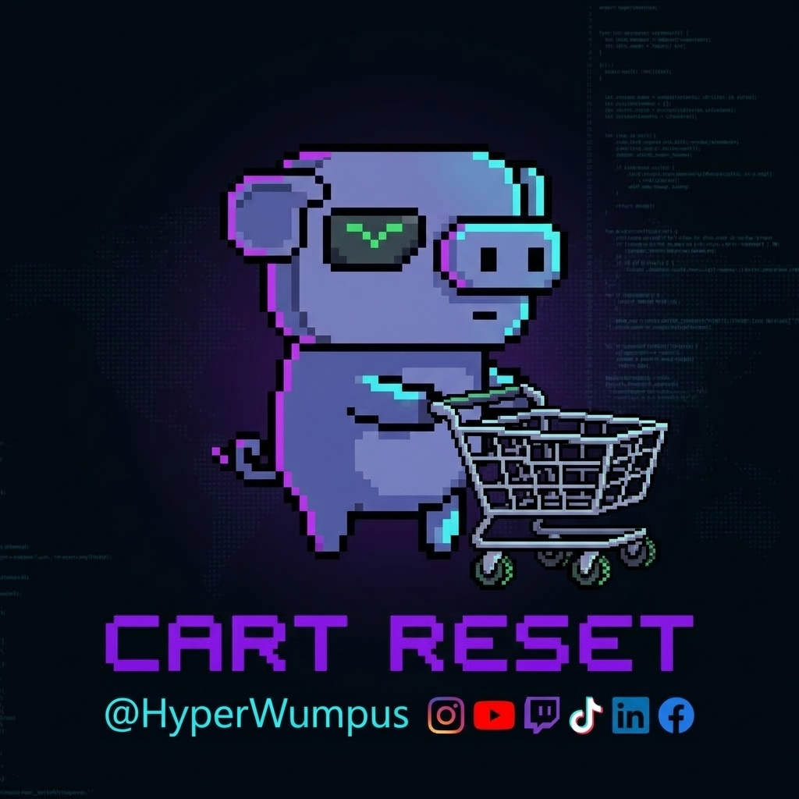

# Cart Reset by HyperWumpus



**Keep the reminder. Lose the clutter.**

Cart Reset is a Chrome extension for the moment your shopping cart becomes a collection of “ooh, that looks good,” “it’s on sale,” and “maybe I’ll buy it later.” Those products are useful visual reminders—until sorting a hundred of them becomes another chore.

Created by **HyperWumpus**, inspired by the friction of ADHD and saving things for later. The goal is simple: keep your finds visible and make cart cleanup take fewer decisions and fewer clicks.

## What it does

- Shows recognized Walmart and Costco Same-Day cart products with thumbnails and product links.
- Suggests **Groceries** and **Other finds** groups, with a dropdown to correct each item.
- Selects individual items, a group, or every detected item.
- Moves selected items to Walmart’s **Saved for later**, in batches.
- Removes selected product rows, including their quantities, after confirmation.
- Downloads a readable, grouped HTML list of product links.
- Shows progress and lets you stop after the current item.

## Store support

| Store or platform | Status |
| --- | --- |
| Walmart.com cart in desktop Chrome | Supported; early version |
| Costco Same-Day (`sameday.costco.com`) in desktop Chrome | Early integration; open the cart drawer first |
| Regular Costco.com cart / Saved for Later | Not implemented |
| Other stores | Not implemented |
| iPhone shopping apps | Not supported directly |
| Safari | Not packaged or tested |

Each store needs its own verified cart integration. This extension does not automatically work across shopping sites.

## Install in Chrome

1. Download this repository as a ZIP and extract it, or clone it.
2. Open `chrome://extensions` in Chrome.
3. Turn on **Developer mode**.
4. Choose **Load unpacked** and select the repository folder containing `manifest.json`.
5. Open [your Walmart cart](https://www.walmart.com/cart) and sign in to Walmart yourself.
6. For Costco Same-Day, open its cart drawer first.
7. Click **Cart Reset by HyperWumpus** in the extensions menu. Pin it for easy access.

When updating, reload the extension on the Extensions page, close any old Cart Reset panel, and reopen it.

## Use it

Select the products you want to move, then choose **Save selected for later** or **Remove selected**. A confirmation appears before either action starts. Begin with one item to check your current cart layout.

**Save for later** uses Walmart’s own list. Items leave the active cart but stay in your Walmart account. Group labels apply to this extension’s panel only; they do not create categories in Walmart’s saved list.

Group corrections last until the panel closes. **Download grouped product links** keeps a separate reference copy you can open in your browser. That file contains links, not a restorable cart or guaranteed prices/quantities.

## Costco Same-Day

Open the cart drawer and click the extension. Select rows, adjust groups, download a grouped visual reminder list, or remove selected products after confirmation. Native Save for later is hidden because no such control was found in this cart layout.

Same-Day rows expose product buttons rather than permalinks, so the downloaded list preserves names, thumbnails and quantities. Image URLs load when the list is opened; it is not an offline image archive or a restorable cart.

Removal includes all quantities. For quantity two or more, the extension decreases one unit at a time and waits for confirmation before the next click. Stopping can leave a partly reduced quantity. Closing the retailer drawer or opening another dialog stops the batch.

Live detection, selection and confirmation cancellation were checked against the current Costco drawer. Automated simulations check removal, quantities, ambiguity, timeouts and stopping. Live removal still needs a user-chosen trial item; no real cart products were removed during these checks.

## Privacy and permissions

Cart Reset uses `activeTab` and `scripting`. It runs when you click its icon, and its code accepts `www.walmart.com/cart` and Costco store pages on `sameday.costco.com` with the cart drawer open.

There is no backend, analytics, account registration, or persistent shopping-data storage. Product thumbnails reuse Walmart or Instacart image URLs. The extension does not collect login credentials or payment details, interact with checkout, or submit orders.

Downloaded lists stay wherever you save them. No personal cart screenshots or exported shopping lists are included in this repository.

## Current limits

- Only recognized, loaded, expanded cart rows are shown.
- Groceries are suggested using Walmart’s SNAP EBT labels; this is a rough grouping cue, not a complete product taxonomy.
- Ambiguous matches stop the batch rather than guessing.
- A stopped batch does not undo items already moved or removed.
- Website changes can break detection. Phone-app cart synchronization has not been verified.
- This is a personal project, not a medical product. It makes no claims about treating ADHD.

## Development

No build step or third-party dependencies are required. `background.js` opens the panel; `cart-reset.js` contains the retailer integrations and interface.

Basic code checks:

```sh
node --check background.js
node --check cart-reset.js
python3 -m json.tool manifest.json
node --test tests/costco-removal.test.cjs
```

For a live check, verify selection, group correction, cancellation, and one user-chosen cart action before trying a large batch. Never test against someone else’s cart or select items on their behalf.

## Roadmap

- Regular Costco.com and Amazon integrations.
- A persistent visual “maybe later” shelf and remembered groups.
- More categories and a quick review mode.
- More Wumpi expressions and HyperWumpus details.
- Safari packaging after the Chrome flow is reliable.

## Signature

Creator-supplied Cart Reset artwork forms the panel background and visible social signature. A transparent Wumpi pushing a cart is used for the extension icon and panel mascot. Earlier mascot studies remain in `icons/`. Social platform marks identify the creator’s presence; no profile links are inferred.

Independent project. Not affiliated with Walmart, Costco, Amazon or Instacart.
